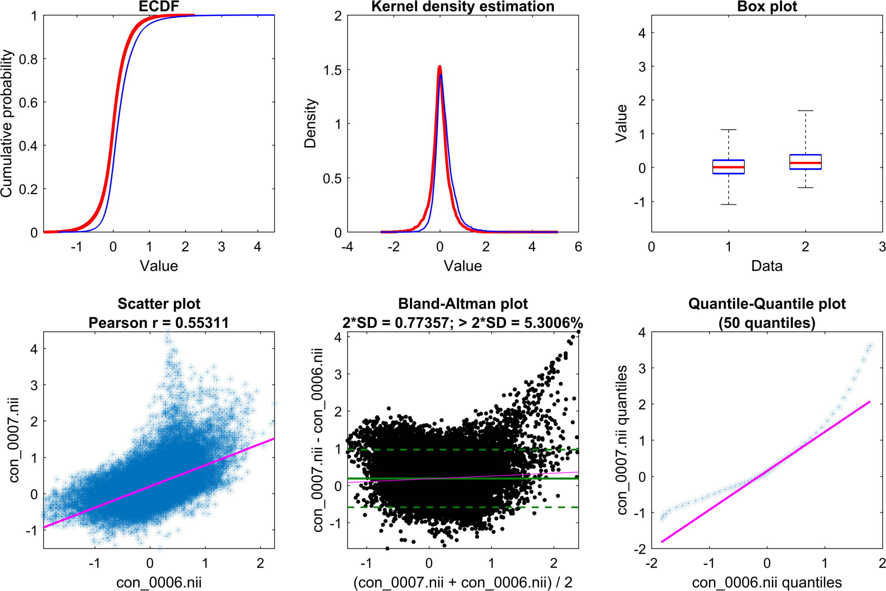

# `vis`

Visualized exploratory data analysis tools for functional or structural 3-D brain volumes; for use with the [SPM](https://www.fil.ion.ucl.ac.uk/spm/) analysis suite.

For CURRENT VERSION, please visit [here](http://tools.robjellis.net).

For documentation, see [here](http://robjellis.net/tools/vis_documentation.pdf).

## Sample output

